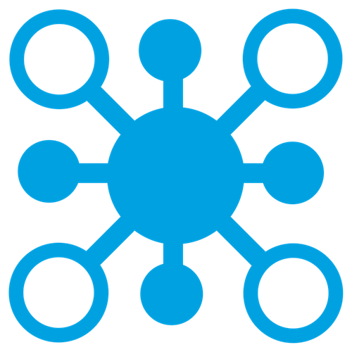
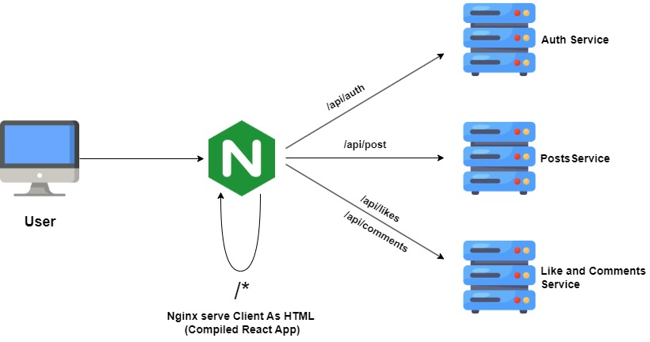
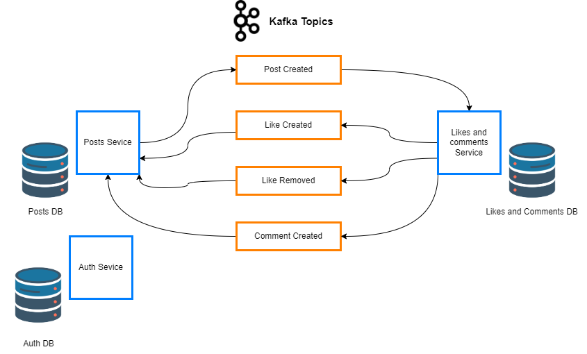
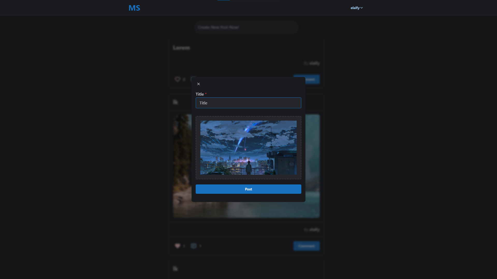
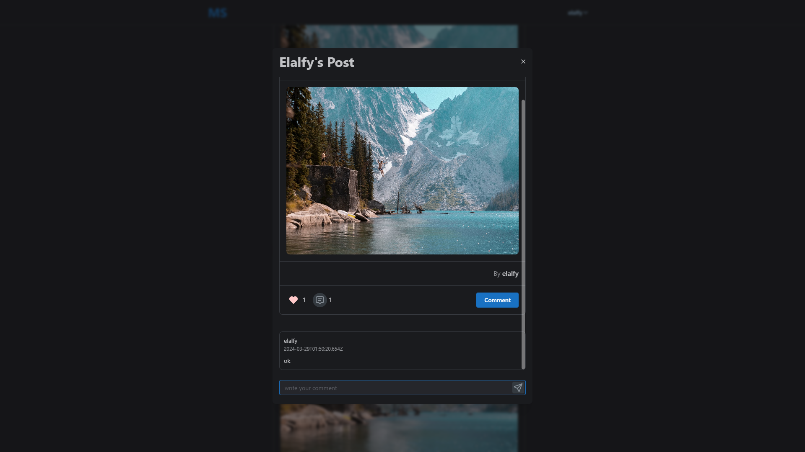

<a name="readme-top"></a>

<!-- PROJECT LOGO -->
<br />
<div align="center">
  <a href="https://github.com/Elalfy74/social-media-microservices">
    
  </a>

  <h3 align="center">Social Media Microservices</h3>

  <p align="center">
    Microservices app built with NestJS and Kafka.
  </p>
</div>

<!-- TABLE OF CONTENTS -->
<details>
  <summary>Table of Contents</summary>
  <ol>
    <li>
      <a href="#about-the-project">About The Project</a>
      <ul>
        <li><a href="#built-with">Built With</a></li>
        <li><a href="#architecture">Architecture</a></li>
        <li><a href="#kafka">Kafka</a></li>
        <li><a href="#client">Client</a>
        </li>
      </ul>
    </li>
    <li>
      <a href="#getting-started">Getting Started</a>
      <ul>
        <li><a href="#prerequisites">Prerequisites</a></li>
        <li><a href="#installation">Installation</a></li>
      </ul>
    </li>
    <li><a href="#contact">Contact</a></li>
  </ol>
</details>

<!-- ABOUT THE PROJECT -->

## About The Project

[![product-screenshot][product-screenshot]](https://github.com/Elalfy74/social-media-microservices)

- Microservice application utilizes Kafka as the messaging broker and NGINX as both a reverse proxy and a web server
  (compiled React app).
- Each service operates independently with its own DB, ensuring modularity and scalability.
- Utilize Docker-compose to run all services in one network, making development and deployment easier.

<p align="right">(<a href="#readme-top">back to top</a>)</p>

### Built With


## Architecture



- App consist of three microservices: Authentication, Posts, and Likes Comments.
- All Backend services are built in NestJS monorepo.
- Nginx is used as a reverse proxy to redirect requests to the correct microservice.
- Posts service is responsible for the creation, deletion, and retrieval of posts.
- Likes service is responsible for the creation, deletion, and retrieval of likes.
- Comments service is responsible for the creation, deletion, and retrieval of comments.
- Posts service can work alone to retrieve posts with likes count and comments count which is used in the home page.
- Likes and comments service can be used independently to create and delete likes and comments even if posts service is not available.
- Services communicate with each other using Kafka messaging broker.

## Kafka



- Kafka is used as a messaging broker for all services.
- Kafka has a set of topics which are used for each service.
- Posts service produce post.created event to the topic post.created and likes and comments service consume it.

## Client




- Client is a React app built with Mantine UI.
- The app is hosted on NGINX.
- Client can be used to create, delete, and retrieve posts.

<p align="right">(<a href="#readme-top">back to top</a>)</p>

<!-- GETTING STARTED -->

## Getting Started

### Prerequisites

- Node.js
- npm or yarn
- Docker
- Docker-compose

### Installation

1. Clone the repo
   ```sh
   git clone https://github.com/Elalfy74/social-media-microservices
   ```
2. Install NPM packages

   ```sh
   cd server
   yarn

   cd ../client
   yarn
   ```

3. Start the project
   ```sh
   docker-compose -f docker-compose.dev.yml up
   ```

<p align="right">(<a href="#readme-top">back to top</a>)</p>

<!-- CONTACT -->

## Contact

Mahmoud Elalfy - [@Mahmoudelalfy74](https://twitter.com/Mahmoudelalfy74) -
[@Portfolio](https://mahmoud-elalfy.vercel.app/) -
[@LinkedIn](https://www.linkedin.com/in/mahmoud-elalfy-79b894209/)

Project Link: [Social Media Microservices](https://github.com/Elalfy74/social-media-microservices)

<p align="right">(<a href="#readme-top">back to top</a>)</p>

[product-screenshot]: assets/images/architecture.jpg
